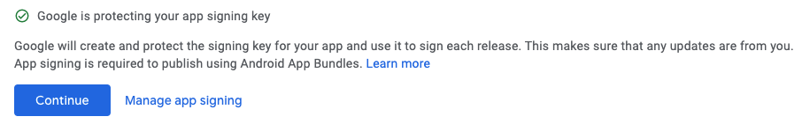
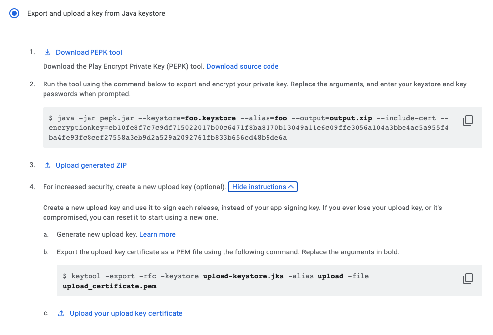

# mobile-tools

All useful scripts gathered in one place.

### Install

`$ brew tap leancodepl/tools`

`$ brew install mobile-tools`

## Programs

To learn more about programs, see their source code. They should have an
extensive comment at the top of the file.

### generate-keystore

Generates `tst`, `prod_upload`, and `prod` keystore (`.jks`) files.

**App signing by Google Play**

Upload created `prod` key instead of letting Google Play create one.

Uploading keystore to Google is available when uploading the first build.

**IMPORTANT!**

Adding `prod_upload` key needs to be done in the same transaction!

 
