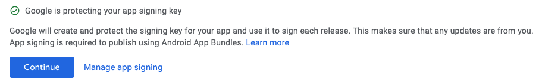
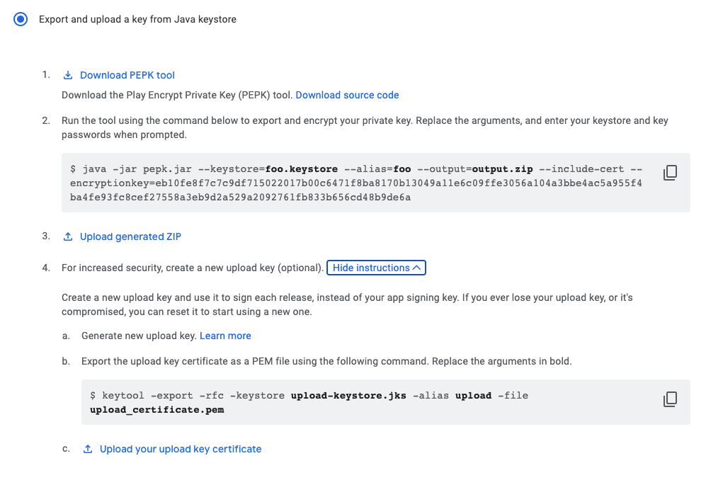

# mobile-tools

All useful scripts gathered in one place.

### Install

`$ brew tap leancodepl/tools`

`$ brew install mobile-tools`

## Programs

To learn more about programs, see their source code. They should have an
extensive comment at the top of the file.

---

### patrol-bs

A unified CLI for BrowserStack mobile app testing. Supports building and uploading Android/iOS apps, and fetching test outputs.

#### Quick Start

```bash
# Build and upload Android app
patrol-bs android --target integration_test/app_test.dart

# Build and upload iOS app
patrol-bs ios --config prod --devices '["iPhone 16 Pro-18"]'

# Get outputs from a completed build
patrol-bs outputs abc123-build-id --verbose
```

#### Commands

| Command | Description |
|---------|-------------|
| `android` | Build and upload Android APKs to BrowserStack |
| `ios` | Build and upload iOS apps to BrowserStack |
| `outputs` | Get outputs/artifacts from a BrowserStack build |
| `config` | Manage configuration (credentials, project, devices) |

#### Configuration

**Interactive Setup (Recommended)**

```bash
# Run interactive setup wizard
patrol-bs config init
```

**Setting Values via CLI**

```bash
# Set credentials
patrol-bs config set credentials "username:access_key"

# Set project name
patrol-bs config set project "MyApp"

# Set devices
patrol-bs config set android.devices '["Samsung Galaxy S24-14.0"]'
patrol-bs config set ios.devices '["iPhone 15 Pro-17"]'

# View current configuration
patrol-bs config list
```

**Named Profiles**

Create different profiles for different projects or environments:

```bash
# Create a profile for production
patrol-bs config create production
patrol-bs config use production
patrol-bs config set project "MyApp-Prod"
patrol-bs config set android.devices '["Samsung Galaxy S24-14.0"]'

# Switch back to default
patrol-bs config use default

# List all profiles
patrol-bs config profiles
```

**Configuration Priority**

Configuration is loaded in order (later overrides earlier):
1. Built-in defaults
2. Profile config (`~/.config/patrol-bs/config`)
3. Legacy config (`~/.patrol-bs.conf`)
4. Project config (`.patrol-bs.conf` in current dir)
5. Environment variables (`PATROL_BS_*`)
6. Command-line arguments

**Environment Variables:**

| Variable | Description |
|----------|-------------|
| `PATROL_BS_CREDENTIALS` | BrowserStack credentials (`username:access_key`) |
| `PATROL_BS_PROJECT` | Project name on BrowserStack |
| `PATROL_BS_TIMEOUT` | Idle timeout in seconds (default: 240) |
| `PATROL_BS_ANDROID_DEVICES` | Default Android devices (JSON array) |
| `PATROL_BS_IOS_DEVICES` | Default iOS devices (JSON array) |

#### Common Options

| Option | Description |
|--------|-------------|
| `--credentials <user:key>` | BrowserStack credentials |
| `--project <name>` | Project name |
| `--devices <json>` | Devices to test on (JSON array) |
| `--tablets` | Use tablet devices instead of phones |
| `--config <dev\|prod>` | Build configuration |
| `--flavor <name>` | Build flavor |
| `--timeout <seconds>` | Idle timeout |
| `--slow-internet` | Use slow network profile |
| `--skip-build` | Skip building, only upload |
| `--build-tag <tag>` | Custom build tag |

Run `patrol-bs <command> --help` for command-specific options.

---

### generate_keystore

Generates a single keystore (`.jks`) file for Android app signing.
Usage: `$ generate_keystore <owner> <app_name> <type>`

**App signing by Google Play**

Upload created `prod` key instead of letting Google Play create one.

Uploading keystore to Google is available when uploading the first build.

**IMPORTANT!**

Adding `prod_upload` key needs to be done in the same transaction!

 
